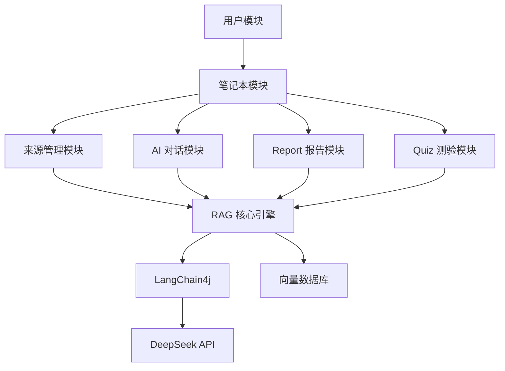

# 模块设计文档

## 1. 系统模块总览

系统按照功能职责划分为以下 **6 大模块**，每个模块从后端到前端形成完整的纵向切片：

```
┌───────────────────────────────────────────────────────────┐
│                        前端模块                            │
│  ┌─────────┐ ┌─────────┐ ┌─────────┐ ┌─────────┐         │
│  │笔记本模块│ │来源管理 │ │ 对话模块 │ │Studio模块│         │
│  │         │ │  模块   │ │         │ │报告+测验 │         │
│  └────┬────┘ └────┬────┘ └────┬────┘ └────┬────┘         │
└───────┼───────────┼───────────┼───────────┼──────────────┘
        │           │           │           │
        ↕           ↕           ↕           ↕  REST API
┌───────┼───────────┼───────────┼───────────┼──────────────┐
│  ┌────┴────┐ ┌────┴────┐ ┌────┴────┐ ┌────┴────┐         │
│  │Notebook │ │ Source  │ │  Chat   │ │ Studio  │         │
│  │Controller│ │Controller│ │Controller││Controller│        │
│  └────┬────┘ └────┬────┘ └────┬────┘ └────┬────┘         │
│  ┌────┴────┐ ┌────┴────┐ ┌────┴────┐ ┌────┴────┐         │
│  │Notebook │ │ Source  │ │  RAG    │ │Report/  │         │
│  │Service  │ │Service  │ │ Service │ │QuizSvc  │         │
│  └────┬────┘ └────┬────┘ └────┬────┘ └────┬────┘         │
│       │           │      ┌────┴────┐      │              │
│       │           │      │LangChain│      │              │
│       │           │      │4j Core  │      │              │
│       │           │      └────┬────┘      │              │
│  ┌────┴────┐ ┌────┴────┐ ┌────┴────┐ ┌────┴────┐         │
│  │Notebook │ │ Source  │ │ Vector  │ │Report/  │         │
│  │ Mapper  │ │ Mapper  │ │  Store  │ │QuizMapper│        │
│  └─────────┘ └─────────┘ └─────────┘ └─────────┘         │
│                        后端模块                            │
└───────────────────────────────────────────────────────────┘
```

---

## 2. 后端模块详细设计

### 2.1 包结构规划

```
com.lyhm.airag
├── AiRagApplication.java                 // 启动类（已有）
├── ai/                                    // AI 相关（已有，需扩展）
│   ├── AiNotebookService.java            // AI 服务接口（已有）
│   ├── AiNotebookServiceFactory.java     // AI 工厂类（已有）
│   ├── ReportAiService.java              // [新增] 报告 AI 服务接口
│   ├── QuizAiService.java               // [新增] 测验 AI 服务接口
│   └── RagService.java                  // [新增] RAG 核心检索服务
│
├── annotation/                           // 自定义注解（已有）
├── aop/                                  // AOP 切面（已有）
├── common/                               // 通用类（已有）
├── config/                               // 配置（已有，需扩展）
│   ├── CorsConfig.java                   // CORS 配置（已有）
│   ├── JsonConfig.java                   // JSON 配置（已有）
│   ├── EmbeddingConfig.java             // [新增] Embedding 模型配置
│   └── VectorStoreConfig.java           // [新增] 向量存储配置
│
├── constant/                             // 常量（已有）
│   └── UserConstant.java                // 用户常量（已有）
│
├── controller/                           // 控制器（已有，需扩展）
│   ├── HealthController.java            // 健康检查（已有）
│   ├── UserController.java              // 用户控制器（已有）
│   ├── NotebookController.java          // [新增] 笔记本控制器
│   ├── SourceController.java            // [新增] 来源控制器
│   ├── ChatController.java             // [新增] 对话控制器
│   ├── ReportController.java           // [新增] 报告控制器
│   └── QuizController.java             // [新增] 测验控制器
│
├── exception/                            // 异常处理（已有）
├── generator/                            // 代码生成（已有）
│
├── mapper/                               // MyBatis Mapper（已有，需扩展）
│   ├── UserMapper.java                  // 用户 Mapper（已有）
│   ├── NotebookMapper.java             // [新增] 笔记本 Mapper
│   ├── SourceMapper.java               // [新增] 来源 Mapper
│   ├── ReportMapper.java               // [新增] 报告 Mapper
│   ├── QuizMapper.java                 // [新增] 测验 Mapper
│   └── QuizRecordMapper.java           // [新增] 测验记录 Mapper
│
├── model/
│   ├── dto/                              // 请求参数
│   │   ├── notebook/                    // [新增] 笔记本相关 DTO
│   │   │   ├── NotebookAddRequest.java
│   │   │   ├── NotebookUpdateRequest.java
│   │   │   └── NotebookQueryRequest.java
│   │   ├── source/                      // [新增] 来源相关 DTO
│   │   │   └── SourceUploadRequest.java
│   │   ├── chat/                        // [新增] 对话相关 DTO
│   │   │   └── ChatRequest.java
│   │   ├── report/                      // [新增] 报告相关 DTO
│   │   │   └── ReportGenerateRequest.java
│   │   └── quiz/                        // [新增] 测验相关 DTO
│   │       ├── QuizGenerateRequest.java
│   │       └── QuizSubmitRequest.java
│   │
│   ├── entity/                           // 实体类
│   │   ├── User.java                    // 用户（已有）
│   │   ├── Notebook.java               // [新增] 笔记本
│   │   ├── Source.java                  // [新增] 来源
│   │   ├── Report.java                 // [新增] 报告
│   │   ├── Quiz.java                   // [新增] 测验
│   │   └── QuizRecord.java            // [新增] 测验记录
│   │
│   ├── enums/                           // 枚举类
│   │   ├── UserRoleEnum.java           // 用户角色（已有）
│   │   ├── ReportTypeEnum.java         // [新增] 报告类型枚举
│   │   ├── QuizDifficultyEnum.java     // [新增] 测验难度枚举
│   │   └── SourceTypeEnum.java         // [新增] 来源类型枚举
│   │
│   └── vo/                              // 视图对象
│       ├── LoginUserVO.java            // 登录用户 VO（已有）
│       ├── UserVO.java                 // 用户 VO（已有）
│       ├── NotebookVO.java            // [新增] 笔记本 VO
│       ├── SourceVO.java              // [新增] 来源 VO
│       ├── ReportVO.java              // [新增] 报告 VO
│       ├── QuizVO.java                // [新增] 测验 VO
│       └── QuizQuestionVO.java        // [新增] 测验题目 VO
│
├── service/                              // 服务层
│   ├── UserService.java                 // 用户服务（已有）
│   ├── NotebookService.java            // [新增] 笔记本服务
│   ├── SourceService.java              // [新增] 来源服务
│   ├── ReportService.java              // [新增] 报告服务
│   ├── QuizService.java                // [新增] 测验服务
│   └── impl/
│       ├── UserServiceImpl.java        // 用户服务实现（已有）
│       ├── NotebookServiceImpl.java    // [新增]
│       ├── SourceServiceImpl.java      // [新增]
│       ├── ReportServiceImpl.java      // [新增]
│       └── QuizServiceImpl.java        // [新增]
│
└── utils/                                // 工具类
    └── DocumentParser.java              // [新增] 文档解析工具
```

---

## 3. 各模块详细设计

### 3.1 RAG 核心模块

> RAG（Retrieval-Augmented Generation）是本系统的技术核心。

#### 3.1.1 核心组件

| 组件 | 说明 | 技术选型 |
|------|------|---------|
| Document Loader | 加载和解析用户上传的文档 | LangChain4j `DocumentParser` |
| Text Splitter | 将文档切分为适合 Embedding 的文本块 | LangChain4j `DocumentSplitter` |
| Embedding Model | 将文本块转为向量表示 | DeepSeek / 或其他 Embedding API |
| Vector Store | 存储和检索文档向量 | 内存 `InMemoryEmbeddingStore` 或 Milvus |
| Content Retriever | 根据查询检索相关文档片段 | LangChain4j `EmbeddingStoreContentRetriever` |
| AI Service | LLM 对话生成 | LangChain4j `AiServices` + DeepSeek |

#### 3.1.2 RAG 流水线

```java
// 伪代码展示 RAG 检索流程
public String ragChat(Long notebookId, String userMessage, List<Long> sourceIds) {
    // 1. 获取笔记本对应的向量存储
    EmbeddingStore store = getEmbeddingStore(notebookId);
    
    // 2. 构建内容检索器
    ContentRetriever retriever = EmbeddingStoreContentRetriever.builder()
        .embeddingStore(store)
        .embeddingModel(embeddingModel)
        .maxResults(5)
        .minScore(0.7)
        .build();
    
    // 3. 检索相关内容
    List<Content> relevantContents = retriever.retrieve(Query.from(userMessage));
    
    // 4. 构建带上下文的 AiService 并生成回答
    return AiServices.builder(AiNotebookService.class)
        .chatModel(chatModel)
        .contentRetriever(retriever)
        .build()
        .notebooklmApp(userMessage);
}
```

#### 3.1.3 LangChain4j 关键依赖说明

需要在 `pom.xml` 中新增以下依赖：

```xml
<!-- 文档解析 -->
<dependency>
    <groupId>dev.langchain4j</groupId>
    <artifactId>langchain4j-document-parser-apache-tika</artifactId>
</dependency>

<!-- 内存向量存储（开发阶段） -->
<dependency>
    <groupId>dev.langchain4j</groupId>
    <artifactId>langchain4j-embeddings</artifactId>
</dependency>

<!-- Spring Boot 集成 -->
<dependency>
    <groupId>dev.langchain4j</groupId>
    <artifactId>langchain4j-spring-boot-starter</artifactId>
</dependency>
```

> **学习要点**：LangChain4j 的 RAG examples 项目中有 15 个示例代码，覆盖了从简单到高级的各种 RAG 模式。建议从 `_1_easy/Easy_RAG_Example.java` 开始学习，逐步理解 `_2_naive` 和 `_3_advanced` 中的进阶用法。

---

### 3.2 报告生成模块

#### 3.2.1 模块职责

```
ReportController          → 接收报告生成请求、报告 CRUD
    ↓
ReportService             → 报告业务逻辑（参数校验、数据持久化）
    ↓
ReportAiService           → 调用 LLM 生成报告内容
    ↓
RagService                → 检索相关文档片段作为报告素材
```

#### 3.2.2 报告生成 Prompt 设计

不同类型的报告使用不同的 Prompt 模板：

```
resources/prompt/
├── report-briefing.txt       // 简报 Prompt
├── report-study-guide.txt    // 学习指南 Prompt
├── report-faq.txt            // FAQ Prompt
├── report-timeline.txt       // 时间线 Prompt
└── report-custom.txt         // 自定义 Prompt（接受用户输入）
```

**示例 Prompt（简报类型）**：
```text
你是一名专业的文档分析师。请根据以下文档内容，生成一份简洁的简报文档。

要求：
1. 使用 Markdown 格式
2. 包含「摘要」「关键发现」「详细信息」「结论」四个部分
3. 每个关键论点必须标注引用来源 [n]
4. 语言简洁专业，适合高管快速阅读

文档内容如下：
{{documents}}
```

#### 3.2.3 关键流程：流式生成

```java
// 使用 LangChain4j 的流式 AI 服务
@SystemMessage(fromResource = "prompt/report-briefing.txt")
Flux<String> generateBriefingReport(String documents);
```

前端通过 **SSE（Server-Sent Events）** 接收流式报告内容，并实时渲染 Markdown。

---

### 3.3 测验生成模块

#### 3.3.1 模块职责

```
QuizController             → 测验生成请求、测验 CRUD、答题提交
    ↓
QuizService                → 测验业务逻辑（参数校验、成绩计算、数据持久化）
    ↓
QuizAiService              → 调用 LLM 生成测验题目 JSON
    ↓
RagService                 → 检索相关文档片段作为出题素材
```

#### 3.3.2 测验生成 Prompt 设计

```text
你是一名专业的出题专家。请根据以下文档内容，生成 {{count}} 道选择题。

难度级别：{{difficulty}}

要求：
1. 每道题有 4 个选项（A/B/C/D），仅有一个正确答案
2. 题目应覆盖文档中的不同知识点
3. 严格以 JSON 数组格式返回，不要包含其他内容
4. JSON 格式如下：
[
  {
    "question": "题目文本",
    "options": [
      {"label": "A", "text": "选项文本"},
      {"label": "B", "text": "选项文本"},
      {"label": "C", "text": "选项文本"},
      {"label": "D", "text": "选项文本"}
    ],
    "correctAnswer": "正确选项字母",
    "explanation": "答案解释，说明为什么这个选项是正确的"
  }
]

文档内容如下：
{{documents}}
```

#### 3.3.3 关键流程：答题与评分

```
┌────────────┐     ┌────────────┐     ┌────────────┐
│ 生成测验    │ ──→ │ 逐题答题    │ ──→ │ 成绩统计    │
│            │     │            │     │            │
│ POST       │     │  前端交互   │     │ POST       │
│ /quiz/     │     │  即时反馈   │     │ /quiz/     │
│ generate   │     │            │     │ submit     │
└────────────┘     └────────────┘     └────────────┘
                                           │
                                           ↓
                                      ┌────────────┐
                                      │ 保存记录    │
                                      │ quiz_record │
                                      │ 表          │
                                      └────────────┘
```

---

### 3.4 来源管理模块

#### 3.4.1 文件上传与处理流程

```java
// 核心处理链路
public void processSource(MultipartFile file, Long notebookId) {
    // 1. 保存原始文件到磁盘
    String filePath = fileService.saveFile(file);
    
    // 2. 使用 LangChain4j 解析文档
    Document document = DocumentParser.parse(filePath);
    
    // 3. 文档分块
    DocumentSplitter splitter = DocumentSplitters.recursive(500, 50);
    List<TextSegment> segments = splitter.split(document);
    
    // 4. 向量化并存入向量存储
    List<Embedding> embeddings = embeddingModel.embedAll(segments).content();
    embeddingStore.addAll(embeddings, segments);
    
    // 5. 保存来源记录到 MySQL
    Source source = new Source();
    source.setNotebookId(notebookId);
    source.setFileName(file.getOriginalFilename());
    source.setFilePath(filePath);
    source.setSegmentCount(segments.size());
    sourceMapper.insert(source);
}
```

#### 3.4.2 支持的文件类型

| 文件类型 | MIME Type | 解析方式 |
|---------|-----------|---------|
| PDF | application/pdf | Apache Tika |
| TXT | text/plain | 直接读取 |
| Markdown | text/markdown | 直接读取 |
| Word | application/docx | Apache Tika |

---

## 4. 前端模块详细设计

### 4.1 页面结构规划

```
src/pages/
├── HomePage.vue                    // 首页 → 笔记本列表页
│
├── notebook/
│   └── NotebookDetailPage.vue     // 笔记本详情页（三栏布局）
│
├── user/
│   ├── UserLoginPage.vue          // 登录页（已有）
│   └── UserRegisterPage.vue       // 注册页（已有）
│
└── admin/
    └── UserManagePage.vue          // 用户管理页（已有）
```

### 4.2 组件结构规划

```
src/components/
├── GlobalHeader.vue               // 顶部导航栏（已有，需修改）
├── GlobalFooter.vue               // 底部版权栏（已有）
│
├── notebook/                      // [新增] 笔记本相关组件
│   ├── NotebookCard.vue           // 笔记本卡片
│   ├── CreateNotebookDialog.vue   // 创建笔记本弹窗
│   ├── SourcePanel.vue            // 左侧来源面板
│   ├── ChatPanel.vue              // 中间对话面板
│   ├── StudioPanel.vue            // 右侧 Studio 面板
│   └── SourceUploadDialog.vue     // 来源上传弹窗
│
├── report/                        // [新增] 报告相关组件
│   ├── ReportTypeSelector.vue     // 报告类型选择器
│   ├── ReportViewer.vue           // 报告内容查看器（Markdown 渲染）
│   └── ReportCard.vue             // 报告列表卡片
│
└── quiz/                          // [新增] 测验相关组件
    ├── QuizConfigDialog.vue       // 测验配置弹窗
    ├── QuizQuestion.vue           // 单题组件
    ├── QuizResult.vue             // 测验结果展示
    └── QuizCard.vue               // 测验列表卡片
```

### 4.3 状态管理（Pinia Stores）

```
src/stores/
├── loginUser.ts                   // 用户登录状态（已有）
├── notebook.ts                    // [新增] 当前笔记本状态
└── chat.ts                        // [新增] 对话消息状态
```

### 4.4 API 层扩展

```
src/api/
├── userController.ts              // 用户 API（已有）
├── healthController.ts            // 健康检查 API（已有）
├── notebookController.ts          // [新增] 笔记本 API
├── sourceController.ts            // [新增] 来源 API
├── chatController.ts              // [新增] 对话 API（含 SSE）
├── reportController.ts            // [新增] 报告 API
└── quizController.ts              // [新增] 测验 API
```

### 4.5 路由规划

```typescript
// 新增路由
const routes = [
  { path: '/', component: HomePage },                    // 已有
  { path: '/notebook/:id', component: NotebookDetailPage }, // 新增
  { path: '/user/login', component: UserLoginPage },      // 已有
  { path: '/user/register', component: UserRegisterPage },// 已有
  { path: '/admin/userManage', component: UserManagePage },// 已有
]
```

---

## 5. 模块间依赖关系



> **关键理解**：所有业务模块（对话、报告、测验）最终都依赖 RAG 核心引擎来检索文档内容。RAG 引擎是整个系统的"心脏"。
